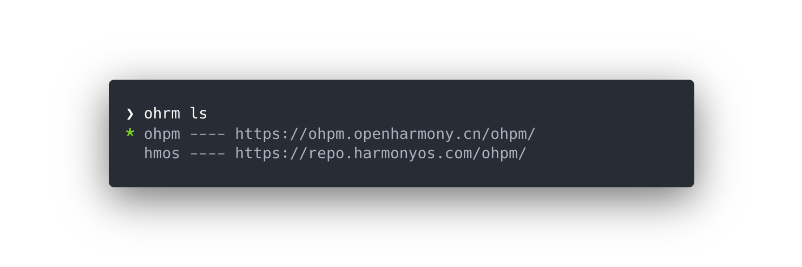
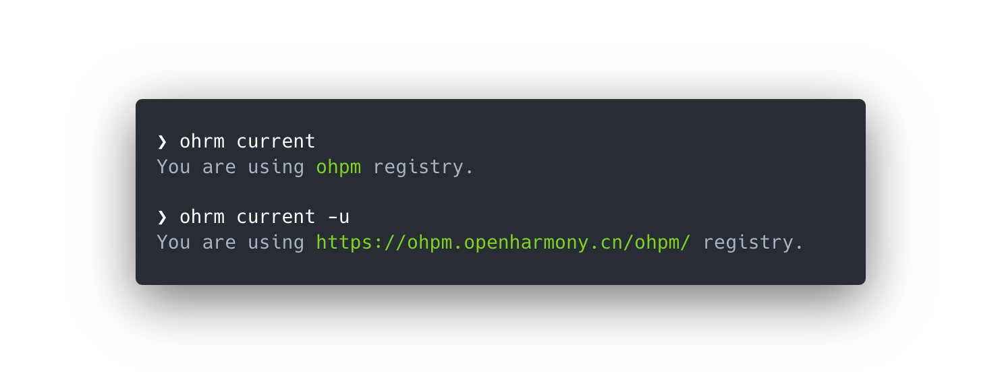
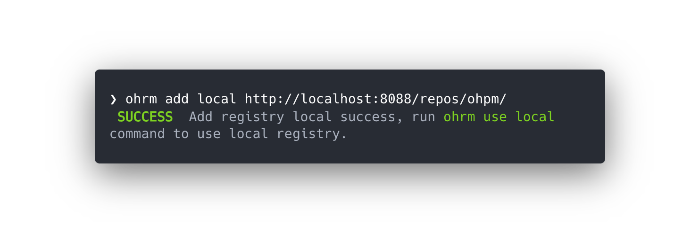

<p align="center">
  
</p>

# ohrm -- ohpm registry manager

ohpm registry manager can help you switch between different ohpm registries easily and fast.

Show all registries

<pre align="center">ohrm ls</pre>

Switch to a specified registry

<pre align="center">ohrm use &lt;registryName&gt;</pre>

## Features

- ohrm registries management(add/delete/list)
- Switch to some registry easily
- No installation required — `npx ohrm`

## Installation

Install globally

```bash
$ npm install ohrm -g
```

If you don't want to install it globally, you can use `npx` to run it.

```bash
$ npx ohrm <command>
```

## Usage

<p align="center">
List all the registries
<br>
<p align="center" style="font-size: smaller; color: lightgray;">including the default and custom registries</p>

<p align="center">

</p>

<p align="center">Show current registry name or URL</p>

<p align="center">

</p>

<p align="center">Change current registry</p>
<p align="center">

</p>

<p align="center">Add custom registry</p>
<p align="center">

</p>

<p align="center">Delete custom registry</p>
<p align="center">

</p>

```
Usage: ohrm [options] [command]

Options:
  -v --version             output the version number
  -h, --help               display help for command

Commands:
  ls                       List all the registries
  current [options]        Show current registry name or URL
  use <name>               Change current registry
  add <name> <url> [home]  Add custom registry
  del <name>               Delete custom registry
  help [command]           display help for command
```

## Registries

- [ohpm](https://ohpm.openharmony.cn/)
- [hmos](https://repo.harmonyos.com/)

## Credit

`ohrm` is inspired by [nrm(npm registry manager)](https://github.com/Pana/nrm).

## LICENSE

MIT Copyright © 2024 [薄涛](https://github.com/melodyVoid)
